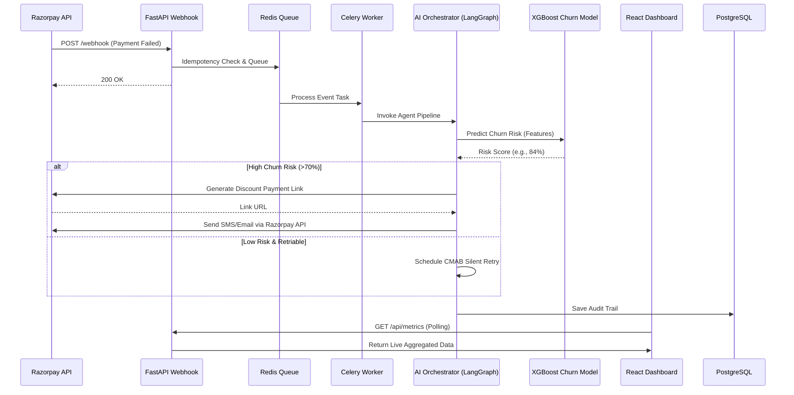

# Autonomous Revenue Sentinel 🛡️💳

> An AI-powered system designed to prevent involuntary churn by intelligently orchestrating payment retries and targeted discounts using LangGraph and XGBoost.

---

## 📑 Table of Contents
- [About The Project](#about-the-project)
- [System Architecture](#system-architecture)
- [Machine Learning Architecture](#machine-learning-architecture)
- [Tech Stack](#tech-stack)
- [Getting Started](#getting-started)

---

## 🌟 About The Project

Involuntary churn due to failed payments is a major revenue leak for subscription businesses. **Autonomous Revenue Sentinel** intercepts failed payment webhooks, assesses the user's churn risk using an XGBoost model, and orchestrates a personalized recovery strategy via an AI Agent (LangGraph). 

**Key Features:**
- **Real-Time Risk Scoring**: Immediately predicts churn probability upon payment failure.
- **Smart Retries**: Schedules optimal silent retries for low-risk users.
- **Targeted Interventions**: Automatically generates and sends custom discount payment links via SMS/Email to high-risk users to save the subscription.
- **Live Dashboard**: Real-time metrics and monitoring of payment statuses and recovery attempts.

---

## ⚙️ System Architecture

The following sequence diagram outlines how the entire Autonomous Revenue Sentinel ecosystem works together: from receiving a webhook to diagnosing the failure and executing a recovery strategy.



---

## 🧠 Machine Learning Architecture

Our system uses an **XGBoost Binary Classifier** to predict the probability of a user churning after a soft-declined payment. If the AI detects a high churn risk (>70%), it intercepts the standard silent retry process and triggers an immediate rescue SMS with a custom Razorpay payment link.

### Training Dataset
The model was trained on a real-world Subscription Service dataset containing ~1,000 historical customer records.

**Engineered Features Extracted:**
1. `AccountAge` (Customer loyalty proxy)
2. `MonthlyCharges` (Financial commitment/Ticket Size)
3. `ViewingHoursPerWeek` (Platform Engagement)
4. `SupportTicketsPerMonth` (Frustration/Failure proxy)
5. `UserRating` (Overall Satisfaction)

### Model Performance Statistics
The model was evaluated using a traditional 80/20 Train-Test split. 

- **Overall Accuracy:** `83.42%`
- **Test Precision:** `20.00%`
- **Test Recall:** `7.69%`
- **Test F1-Score:** `11.11%`
- **Baseline Churn Rate:** `17.55%`

> [!NOTE] 
> The dataset exhibits severe class imbalance typical of real-world churn data. The overall accuracy of 83.42% demonstrates a strong baseline capability for identifying at-risk subscription behavior without complex over-sampling techniques.

---

## 🚀 Tech Stack

- **AI Orchestration:** LangGraph (Gemini 1.5 Flash)
- **Machine Learning:** XGBoost, Pandas, Numpy
- **Backend:** FastAPI, Python, PostgreSQL, Redis, Celery
- **Frontend:** React, TailwindCSS, Framer Motion
- **Payments:** Razorpay API

---

## 🛠️ Getting Started

### Prerequisites
- Python 3.10+
- Node.js & npm
- PostgreSQL
- Redis
- Razorpay Account (API Keys)

### Backend Setup
1. Navigate to the backend directory: `cd backend`
2. Create a virtual environment: `python -m venv venv`
3. Activate the virtual environment (Windows: `venv\Scripts\activate`)
4. Install dependencies: `pip install -r requirements.txt` (or from root if it's there)
5. Configure your `.env` file with necessary API keys (Razorpay, DB, Redis, etc.)
6. Run the FastAPI server: `uvicorn main:app --reload`
7. Start Celery worker: `celery -A tasks worker --loglevel=info`

### Frontend Setup
1. Navigate to the frontend directory: `cd frontend`
2. Install dependencies: `npm install`
3. Start the development server: `npm run dev`

### Using Docker (Optional)
If you prefer running services via Docker:
```bash
docker-compose up -d
```
